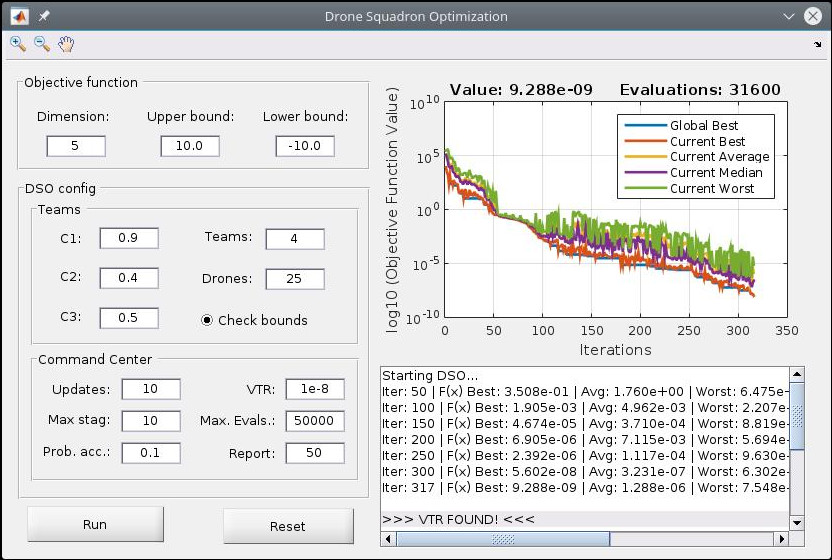

# DSO-MATLAB

Drones, like submarines or the well-known
flying machines, such as balloons, airplanes, helicopters, quadcopters,
can navigate autonomously or remotely. They have sensors, can communicate
over vast distances, can use solar power, and - one of the most
important features - can be upgraded or improved not only concerning hardware
but also by changing their software~(the firmware). Therefore, since
these machines have software~(firmware) to control
their behavior, researchers are free to add mechanisms to the algorithm
as simple software upgrades. 

Drone Squadron Optimization (DSO) is an artifact-inspired technique, as opposed
to many nature-inspired algorithms used today. DSO is
very flexible because it is not related to natural behaviors or  phenomena.
Changing its formulation doesn't make it a 'novel nature-inspired algorithm'.
Therefore, although you change DSO's components, it is still DSO.

DSO is a novel self-adaptive
metaheuristic for global numerical optimization which is updated online (at running time)
by a hyper-heuristic. AFAIK, it is the first meta-heuristic that can improve 
its own code during the optimization process.

DSO has two core parts: the semi-autonomous drones that fly over a
landscape to explore, and the command center that processes the retrieved
data and updates the drones' firmware whenever necessary. 

## Perturbations

The self-adaptive
aspect of DSO in this work is the perturbation/movement scheme, which
is the procedure used to generate target coordinates. This procedure
is evolved by the command center during the global optimization process
in order to adapt DSO to the search landscape. 

As one may wonder, DSO can automatically generate formulas that are exactly the same of 
many nature-inspired meta-heuristics. Moreover, it can automatically improve them!

## Capabilities

Because of its automatic adaptation, DSO can do the following:

### Escape from local-optima (poor-quality regions)

### Detect stagnation and explore other regions of the search-space (MaxStagnation and Pacc)

### Detect convergence (lack of population diversity) and restart to continue exploring (ConvThres)

### Discover perturbations that intensify the seach

## Hyper-heuristic configuration

Please, check file DSO/InitGPConfig.m

## Toolbox

We provide a Matlab (R) toolbox for testing purposes. It has controls for several
parameters, while the others must be changed in the source code.

Also, you can zoom and pan the map using the top left controls.

## Minimum requirements

1. `Octave 3.8` or
2. `Matlab (R) 2011`

AFAIK, the Toolbox works only in Matlab.

## License

This project is licensed under GNU GPL v3.

## Citation

To cite DSO in publications use

    de Melo, V.V. & Banzhaf, W. Neural Comput & Applic (2017). doi:10.1007/s00521-017-2881-3
    https://link.springer.com/article/10.1007/s00521-017-2881-3

A BibTeX entry for LaTeX users is

.. code-block:: none

	@Article{deMelo2017,
	author="de Melo, Vin{\'i}cius Veloso
	and Banzhaf, Wolfgang",
	title="Drone Squadron Optimization: a novel self-adaptive algorithm for global numerical optimization",
	journal="Neural Computing and Applications",
	year="2017",
	issn="1433-3058",
	doi="10.1007/s00521-017-2881-3",
	url="http://dx.doi.org/10.1007/s00521-017-2881-3"
	}

## Author

Vinícius Veloso de Melo (Institute of Science and Technology - Federal University of Sao Paulo)

