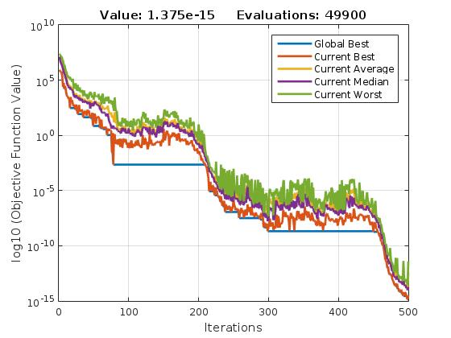

# DSO-MATLAB

Drone Squadron Optimization is a new self-adaptive
metaheuristic for global numerical optimization which is updated online
by a hyper-heuristic. It is the first meta-heuristic that can improve 
its own code during the optimization process.

DSO is an artifact-inspired technique, as opposed
to many nature-inspired algorithms used today. DSO is
very flexible because it is not related to natural behaviors or  phenomena.

DSO has two core parts: the semi-autonomous drones that fly over a
landscape to explore, and the command center that processes the retrieved
data and updates the drones' firmware whenever necessary. 

The self-adaptive
aspect of DSO in this work is the perturbation/movement scheme, which
is the procedure used to generate target coordinates. This procedure
is evolved by the command center during the global optimization process
in order to adapt DSO to the search landscape. 

## Capabilities

Because of such automatic adaptation, DSO can do the following:

### Detect stagnation and explore different regions of the search-space

### Detect convergence (lack of population diversity) and restart to continuing exploring

### Discover perturbations that intensify the seach

We evaluated DSO on
a set of widely employed single-objective benchmark functions. The
statistical analysis of the results shows that the proposed method
is competitive with the other methods, but we plan
several future improvements to make it more powerful and robust.

## Hyper-heuristic configuration

Please, check file DSO/InitGPConfig.m

## Toolbox

We provide a Matlab (R) toolbox for testing purposes. It has controls for the most
parameters, while the others must be changed in the source code.

`Please cite:`
de Melo, V.V. & Banzhaf, W. Neural Comput & Applic (2017). doi:10.1007/s00521-017-2881-3

`https://link.springer.com/article/10.1007/s00521-017-2881-3`

